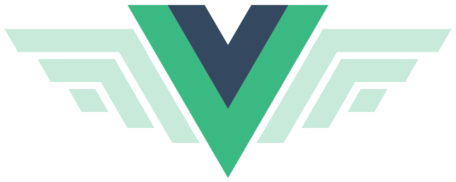
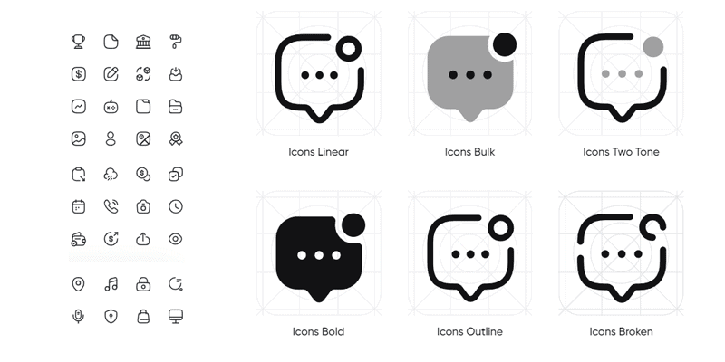

<br>
<br>

<div align="center"></div>

# Iconsax Plus

Iconsax Plus is an enhanced version of the original `Iconsax` package, tailored to address the issues of outdated and unresponsive maintenance. It features a refined icon library, meticulously curated and optimized for seamless integration into Flutter projects. `Iconsax_plus` offers a comprehensive collection of icons, categorized into three distinct styles: `Bold`, `Linear`, and `Broken`, each designed to cater to different visual aesthetics and UI requirements.





## Installation

To use Iconsax Plus in your Flutter project, simply add it as a dependency in your `pubspec.yaml` file:

```shell
flutter pub add iconsax_plus
```
or 

```yaml
dependencies:
  iconsax_plus: ^1.0.0
```

## Usage

To use Iconsax Plus icons in your Flutter application, import the package and use the appropriate style class to access the icons:
```dart
import 'package:iconsax_plus/iconsax_plus.dart';
import 'package:flutter/material.dart';

Column(
  mainAxisAlignment: MainAxisAlignment.center,
  children: [
    Icon(IconsaxPlusBold.home_1),
    Icon(IconsaxPlusLinear.home_1),
    Icon(IconsaxPlusBroken.home_1),
  ],
),
```

License
Iconsax Plus is licensed under the MIT License. See the [LICENSE](LICENSE) file for more information.

---

Iconsax Plus is brought to you by [Iconsax](https://iconsax.io/). For more information, visit [vuesax.com](https://vuesax.com/).